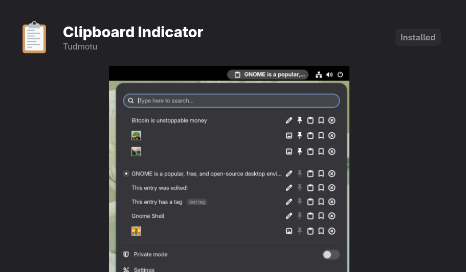
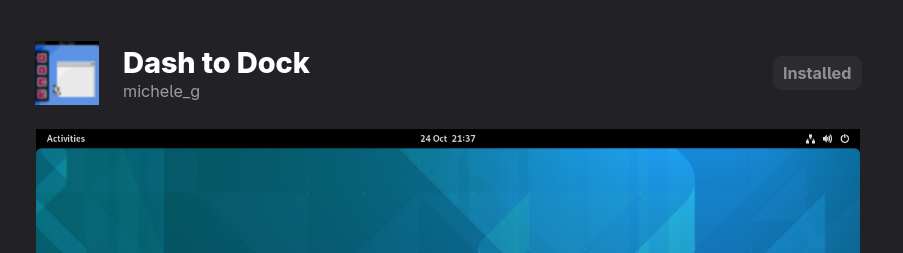
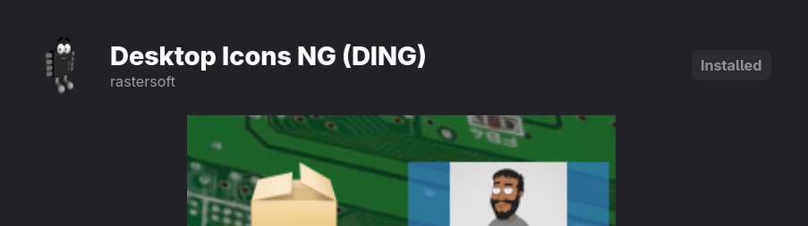
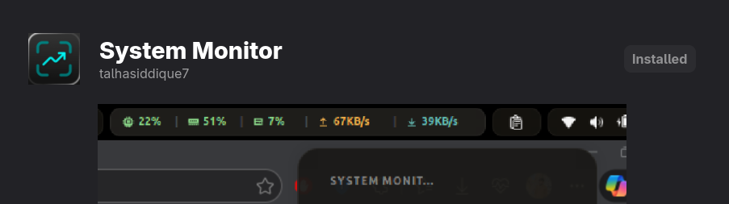
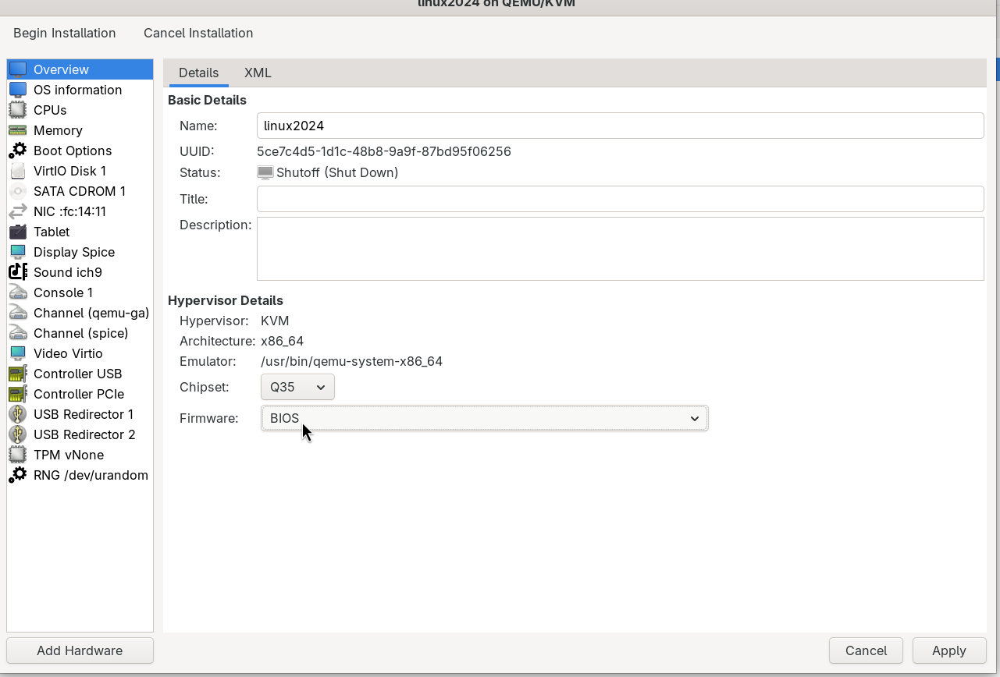

# Linux Setup Guide (Fedora)

A collection of setup notes, shortcuts, and troubleshooting tips for Fedora Linux.

## Table of Contents

- [Extensions](#extensions)
  - [Install Extension Manager Manually](#install-extension-manager-manually)
- [Shortcuts](#shortcuts)
  - [Screenshot Shortcuts](#screenshot-shortcuts)
  - [Open Terminal (Ctrl+Alt+T)](#open-terminal-ctrlaltt)
  - [Minimize All Windows and Go to Desktop](#minimize-all-windows-and-go-to-desktop)
- [Virtualization](#virtualization)
  - [1. Verify Virtualization Support](#1-verify-virtualization-support)
  - [2. Install QEMU/KVM](#2-install-qemukvm)
  - [3. Add User to libvirt Group](#3-add-user-to-libvirt-group)
  - [4. Verify Installation](#4-verify-installation)
  - [5. Create a VM](#5-create-a-vm)
- [Software](#software)
  - [Brave Browser](#brave-browser)
  - [Brave Origin](#brave-origin)
  - [Firefox Browser](#firefox-browser)
  - [Microsoft Edge](#microsoft-edge-browser)
  - [LocalSend File Sharing](#localsend-file-sharing)
- [Setting up AppImage Applications](#setting-up-appimage-applications)
  - [Step 1: Install Required Libraries](#step-1-install-required-libraries)
  - [Step 2: Organize AppImages](#step-2-organize-appimages)
  - [Step 3: Make AppImage Executable](#step-3-make-appimage-executable)
  - [Step 4: Desktop Integration](#step-4-desktop-integration)
- [Installing Applications from Software Store Error](#installing-applications-from-software-store-error)
  - [Option 1: Disable GPG Verification for Flathub](#option-1-disable-gpg-verification-for-flathub)
  - [Option 2: Update System and Flatpak](#option-2-update-system-and-flatpak)
  - [Option 3: Install the Runtime Manually](#option-3-install-the-runtime-manually)
- [Bluetooth Auto Start at Startup Fix](#bluetooth-auto-start-at-startup-fix)
  - [Option 1: Disable Bluetooth Service at Boot](#option-1-disable-bluetooth-service-at-boot)
  - [Option 2: Keep Bluetooth Installed but Off by Default](#option-2-keep-bluetooth-installed-but-off-by-default)
  - [Option 3: Mask the Service (Strongest Disable)](#option-3-mask-the-service-strongest-disable)

---

## Extensions

GNOME Extensions enhance the default desktop experience. Below is how to install the **Extension Manager** (a GUI for browsing and installing extensions) and a few popular extensions.

### Install Extension Manager Manually

> The Extension Manager is available as a Flatpak on Flathub.

```bash
flatpak remote-add --if-not-exists flathub https://dl.flathub.org/repo/flathub.flatpakrepo
flatpak install flathub com.mattjakeman.ExtensionManager
```






These extensions add useful functionality: clipboard history (Clipboard Indicator), a macOS-style dock (Dash to Dock), desktop icons (Desktop Icons NG), and system resource monitoring (System Monitor).

---

## Shortcuts

### Screenshot Shortcuts

Fedora's default screenshot shortcuts (on GNOME):

| Shortcut            | Action                                        |
|---------------------|-----------------------------------------------|
| `PrtSc`             | Opens the interactive screenshot UI           |
| `Alt` + `PrtSc`     | Screenshot of the current window              |
| `Shift` + `PrtSc`   | Select an area to screenshot                  |
| `Ctrl` + `PrtSc`    | Copy full-screen screenshot to clipboard      |

### Open Terminal (Ctrl+Alt+T)

To set up the classic `Ctrl+Alt+T` terminal shortcut:

1. Open **Settings**.
2. Go to **Keyboard -> View and Customize Shortcuts -> Custom Shortcuts**.
3. Click **Add Shortcut**.
4. **Name:** Terminal
5. **Command:** `gnome-terminal` (or `ptyxis` if using the new default GNOME terminal)
6. **Shortcut:** Press `Ctrl+Alt+T`.
7. Click **Add**.

### Minimize All Windows and Go to Desktop

- **Default GNOME Shortcut:** `Super` + `D`
- **Alternative (Focus Desktop):** `Ctrl` + `Alt` + `D`
- **Alternative (Individual Minimize):** `Super` + `Down`

To set up or view the shortcut in Settings:

1. Open **Settings**.
2. Go to **Keyboard > View and Customize Shortcuts**.
3. Select **Navigation**.
4. Find **"Hide all normal windows"** (or **"Show Desktop"**) and set your preferred keys (e.g., `<Super>d`).

---

## Virtualization

Setting up QEMU/KVM on Fedora for running virtual machines.

### 1. Verify Virtualization Support

Ensure your CPU supports hardware virtualization and that it is enabled in BIOS/UEFI.

```bash
lsmod | grep kvm
```

Expected output: `kvm_intel` (for Intel CPUs) or `kvm_amd` (for AMD CPUs).

### 2. Install QEMU/KVM

Install the virtualization group package, which includes `qemu-kvm`, `libvirt`, `virt-install`, and `virt-manager`.

```bash
sudo dnf install @virtualization
```

### 3. Add User to libvirt Group

Add your user to the `libvirt` group to manage VMs without `sudo`.

```bash
sudo usermod -aG libvirt $(whoami)
```

**Important:** Log out and back in for this change to take effect.

### 4. Verify Installation

Ensure the libvirt daemon is active:

```bash
systemctl status libvirtd
```

### 5. Create a VM

Always choose **BIOS** while creating a new VM in virt-manager.



---

## Software

### Brave Browser

```bash
curl -fsS https://dl.brave.com/install.sh | sh
```
To uninstall
```bash
sudo dnf remove brave-browser
```
---
### Brave Origin
```bash
curl -fsS https://dl.brave.com/install.sh | FLAVOR=origin sh
```
To uninstall
```bash
sudo dnf remove brave-origin
```
---
### Firefox Browser

```bash
sudo dnf install firefox
```
To uninstall
```bash
sudo dnf remove firefox
```
---
### Microsoft Edge Browser
#### Install Microsoft Edge from Microsoft's official RPM repository.
1. Add the Microsoft Edge repository:

```bash
sudo dnf config-manager addrepo --from-repofile=https://packages.microsoft.com/yumrepos/edge/config.repo
```

2. Refresh package metadata:

```bash
sudo dnf upgrade --refresh 
```

3. Install the stable version:

```bash
sudo dnf install microsoft-edge-stable
```
> This method configures your system to receive Edge updates through DNF.

To uninstall,
```bash
sudo dnf remove microsoft-edge-stable
```
---
### LocalSend File Sharing

#### Step 1:
Download AppImage file from `https://localsend.org/download`

#### Step 2:
- Follow [AppImage Setup](#setting-up-appimage-applications) Mentioned Below
- Now if you want to configure an option to directly select files, right click and share with Local Send option right into Files (nautilus) application, then proceed with below steps. Otherwise till here it is sufficient to normallly use the file sharing application.

#### Step 3: Install System Dependencies
Before cloning the extension, ensure your system has the necessary python and desktop integration packages installed. Open your terminal and run:

```bash
sudo dnf install nautilus-python python3-gobject procps-ng js-jquery
```

#### Step 4: Download and Install `actions-for-nautilus`

```bash
# Clone the repository
git clone https://github.com/bassmanitram/actions-for-nautilus.git

# Move into the folder and install the extension
cd actions-for-nautilus
make install
```

#### Step 5: Create the LocalSend Configuration

The behavior of the context menu is controlled by a simple JSON profile.

1. Create the configuration directory (if it doesn't already exist):
```bash
mkdir -p ~/.local/share/actions-for-nautilus
```

2. Create or edit the `config.json` file:
```bash
nano ~/.local/share/actions-for-nautilus/config.json
```

3. Paste the following configuration structure into the file. Be sure to point the path to your current LocalSend AppImage location:

```json
{
  "type": "command",
  "label": "LocalSend",
  "actions": [
    {
      "type": "command",
      "label": "Share with LocalSend",
      "command_line": "/home/shams/Applications/LocalSend1170.AppImage %F",
      "cwd": "%d",
      "use_shell": true,
      "mimetypes": ["*/*"]
    }
  ]
}
```

#### Step 6: Restart Nautilus to Apply Changes
For GNOME Files to pick up the new extension and json config, you must completely stop the background Nautilus file manager process:

```bash
nautilus -q
```
Open your file manager again. You can now select any group of files, right-click, and choose **Share with LocalSend** to seamlessly dispatch them.

---
## Setting up AppImage Applications

AppImages are portable Linux applications that run without installation. On Fedora 44, some additional steps are needed.

### Step 1: Install Required Libraries

Fedora 44 removed legacy FUSE2 libraries. Install `fuse-libs` to enable legacy AppImage support.

```bash
sudo dnf install fuse-libs
```

### Step 2: Organize AppImages

Create a dedicated folder to keep your applications organized.

```bash
mkdir -p ~/Applications
```

Move your downloaded `.AppImage` files into this folder.

### Step 3: Make AppImage Executable

You must mark the AppImage as executable to run it.

```bash
chmod +x ~/Applications/YourApp.AppImage
```

### Step 4: Desktop Integration

To make your AppImage appear in your apps menu (like a regular installed app), create a `.desktop` entry.

1. Run the app once to ensure it works:

```bash
./YourApp.AppImage
```

2. Create a desktop entry in `~/.local/share/applications/`:

```bash
nano ~/.local/share/applications/mynotebook.desktop
```

3. Paste the following content (update the `Exec` and `Icon` paths):

```ini
[Desktop Entry]
Type=Application
Name=My App Name
Exec=/home/yourusername/Applications/YourApp.AppImage
Icon=application-x-executable
Categories=Utility;
Terminal=false
```

4. Save and exit (`Ctrl+O`, `Enter`, `Ctrl+X`).

---

## Installing Applications from Software Store Error

If you encounter GPG verification errors when installing from GNOME Software or Flatpak, try these solutions.

### Option 1: Disable GPG Verification for Flathub

This is a recommended temporary workaround.

```bash
flatpak remote-modify --gpg-verification=false flathub
```

Then retry the installation:

```bash
flatpak install flathub org.gnome.Platform//47
flatpak install flathub com.mattjakeman.ExtensionManager
```
### Option 2: Update System and Flatpak

Sometimes older Flatpak versions have trouble verifying GNOME runtime signatures.

```bash
sudo dnf update
sudo dnf install flatpak
```

Then try installing again.

### Option 3: Install the Runtime Manually

Some extensions require a specific GNOME runtime. Install it manually:

```bash
flatpak install flathub org.gnome.Platform//47
```

After that, try installing the Extension Manager again.


---

## Bluetooth Auto Start at Startup Fix

On Fedora, if you want to stop Bluetooth from being enabled automatically at startup, use one of the following options.

### Option 1: Disable Bluetooth Service at Boot

```bash
sudo systemctl disable bluetooth.service
```

To stop it immediately without rebooting:

```bash
sudo systemctl stop bluetooth.service
```

Check its status:

```bash
systemctl is-enabled bluetooth.service
```

### Option 2: Keep Bluetooth Installed but Off by Default

If you occasionally use Bluetooth, leave the service enabled and simply turn Bluetooth off in the desktop settings. On modern Fedora GNOME, the Bluetooth state is usually remembered across reboots.

You can also explicitly block the adapter:

```bash
sudo rfkill block bluetooth
```

Check status:

```bash
rfkill list bluetooth
```

If the block isn't preserved across reboots, use Option 1 instead.

### Option 3: Mask the Service (Strongest Disable)

If something keeps re-enabling Bluetooth:

```bash
sudo systemctl mask bluetooth.service
```

This prevents the service from being started manually or automatically.

To undo:

```bash
sudo systemctl unmask bluetooth.service
```

**Verify after reboot:**

After restarting, run:

```bash
systemctl status bluetooth.service
```

---

> **Note:** All commands assume Fedora Linux. Package names and commands may differ on other distributions.
