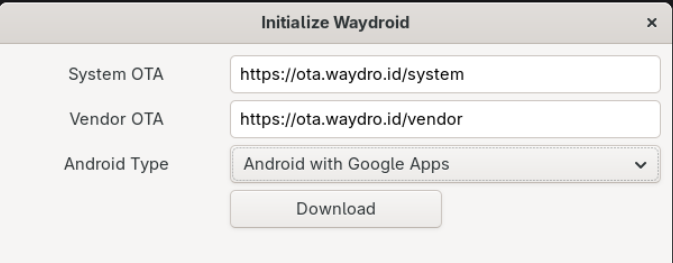

# Sections
### 1. [Installation](#installation)
### 2. [Troubleshootung](#troubleshooting)
### 3. [Uninstallation](#uninstallation)
### 4. [Uninstall Verification](#uninstall-verification)

---

# Installation
```bash
sudo dnf install waydroid
```
---

## Open Application
Enter the following:

System OTA: `https://ota.waydro.id/system`

Vendor OTA: `https://ota.waydro.id/vendor`

> <strong style="color:#24d68f">Recommended to connect to a VPN before starting download</strong>




---

# Troubleshooting
## Manually Starting Waydroid
### Start Container
```bash 
sudo waydroid container start
```

### And in a new terminal tab, start the waydroid session (without sudo):
```bash
waydroid session start
```

### Launch Waydroid In Full-Screen Mode:
```bash
waydroid show-full-ui
```

---

# Uninstallation

### Stop Session Containers

```bash
waydroid session stop
sudo waydroid container stop
```

### Remove Waydroid
```bash
sudo dnf remove waydroid
```

Reboot once
```bash
reboot
```

### Cleanup
```bash
sudo rm -rf /var/lib/waydroid /home/.waydroid ~/waydroid ~/.share/waydroid ~/.local/share/applications/*aydroid* ~/.local/share/waydroid
```

### Clean up unused system packages

```bash
sudo dnf autoremove
```


---

# Uninstall Verification

### Verify everything is gone

```bash
sudo find / -name "*waydroid*" 2>/dev/null
```
If this returns absolutely no output, Waydroid has been completely purged from your machine.

### Delete any remaining files | Example:

```bash
sudo rm -f /usr/share/swcatalog/icons/fedora/128x128/id.waydro.waydroid.png
sudo rm -f /usr/share/swcatalog/icons/fedora/64x64/id.waydro.waydroid.png
sudo rm -f /var/lib/misc/dnsmasq.waydroid0.leases
```

---
# Refresh

### Refresh the software catalog cache
```bash
sudo appstreamcli refresh-cache --force
```

### Reset your desktop icon cache

```bash
update-desktop-database ~/.local/share/applications
```